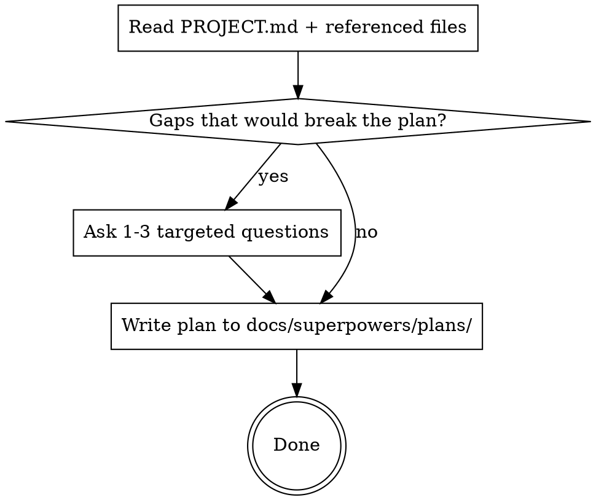

# Quick Plan

## Overview

Turn a rough feature idea or "next steps" dump into a ready-to-execute implementation plan in one short conversation. No spec doc, no reviewer subagent, no visual companion, no design approval gate.

## When to Use

- User describes a feature informally ("I need a page that does X")
- User says "next steps" or "what's left" or "let's add Y"
- Feature is clearly scoped and fits existing patterns in the codebase
- User wants to move fast

**Use full brainstorming instead when:**

- The feature touches multiple independent subsystems
- There's genuine architectural ambiguity
- The user is exploring options, not describing a decision already made

## Process



## Step 1 — Orient

Read `docs/PROJECT.md`. Read any files directly relevant to the feature (existing route files, schema, components the feature will touch). Do not explore broadly.

## Step 2 — Gap Check

Ask yourself: _would a missing answer prevent me from writing complete, correct code?_

**Ask about:** missing data source, unclear mutation, conflicting with existing patterns, ambiguous scope boundary.

**Do not ask about:** things answerable from the codebase, stylistic preferences, hypothetical edge cases.

Maximum 3 questions. If none are needed, skip to Step 3.

## Step 3 — Write the Plan

Save to `docs/superpowers/plans/YYYY-MM-DD-<feature-name>.md`.

Use the standard plan format:

```markdown
# [Feature] Implementation Plan

> **For agentic workers:** Use superpowers:executing-plans to implement this plan task-by-task.

**Goal:** [One sentence]
**Architecture:** [2-3 sentences]
**Tech Stack:** [Key libs]

---

## File Map

| Action | Path | Responsibility |

---

## Task N: [Name]

**Files:** Create/Modify: exact/path

- [ ] Step: description
      `code block if needed`
- [ ] Commit: `git commit -m "..."`
```

**Include in every plan:**

- Exact file paths (no guessing)
- Complete code for non-trivial logic
- A commit step after each task
- A "Known Gotchas" section for anything that could trip up execution

**Omit:**

- Test steps (unless the project has a test framework)
- Verification beyond "run dev server and check"
- Spec document
- Subagent review pass

## Known Gotchas

Add to this section whenever a plan causes an unexpected blocker during execution that would apply across projects.
